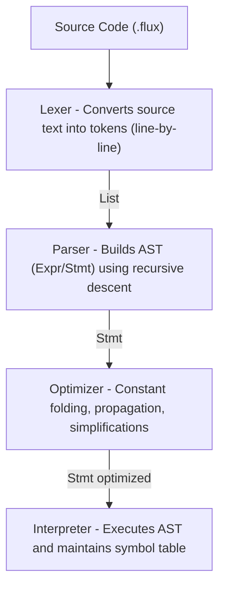

# Flux

A tree-walking interpreted language built in Java.

Flux has arithmetic, mutable and immutable variables, and a REPL for interactive use. Source code is parsed by a recursive descent parser, optimized via constant folding/propagation and algebraic simplifications, then executed by a tree-walking interpreter that uses pattern matching as a visitor-like dispatch.

## Language Features

### Data Types

Everything is a double (IEEE 754 double-precision float).

```
42
3.14
```

### Arithmetic

Standard infix operators with the usual precedence rules:

| Operator | Description    | Example  | Result |
| -------- | -------------- | -------- | ------ |
| `+`      | Addition       | `1 + 2`  | `3.0`  |
| `-`      | Subtraction    | `10 - 3` | `7.0`  |
| `*`      | Multiplication | `4 * 5`  | `20.0` |
| `/`      | Division       | `10 / 4` | `2.5`  |
| `%`      | Modulo         | `10 % 3` | `1.0`  |

Precedence, highest to lowest:

1. Unary `+`, `-`
2. `*`, `/`, `%`
3. `+`, `-`
4. `=` (assignment, right-to-left)

Parentheses override precedence:

```
1 + 2 * 3       # 7.0
(1 + 2) * 3     # 9.0
```

### Variables

#### `let` - Mutable

Declare a variable with `let`. You can reassign it later.

```
let x = 10
x = 20
print x         # 20.0
```

#### `const` - Immutable

Declare a constant with `const`. Trying to reassign it is a runtime error.

```
const pi = 3.14
print pi        # 3.14
pi = 0          # Error: Cannot reassign const variable: pi
```

#### `del` - Delete

Remove a variable from scope. You can re-declare it after deletion.

```
let x = 1
del x
let x = 99      # fine, x was deleted
```

### Statements

#### `print`

Evaluates an expression and prints the result.

```
print 1 + 2     # 3.0
print x * 2
```

#### `exit`

Stops the program. You can optionally pass an exit code (defaults to `0`).

```
exit            # exits with code 0
exit 1          # exits with code 1
```

### Comments

`#` starts a comment. Everything after it on that line is ignored.

```
# this is a full-line comment
print 42    # this is an inline comment
```

### Assignment Expressions

Assignments return the assigned value, so you can chain them:

```
let a = 1
let b = 2
a = b = 10      # both a and b are now 10.0
```

## Example Program

```
# operator precedence demo
const a = 1 + 2 * 3
const b = (1 + 2) * 3
print a
print b

# variables
let x = 10
let y = x + 5
print y
x = 100
print x
```

Output:

```
7.0
9.0
15.0
100.0
```

## Getting Started

### Prerequisites

- **Java 21+** (uses records, pattern matching, switch expressions)
- **Gradle** (wrapper is included, no separate install needed)

### Build

```bash
./gradlew build
```

### Run a Program

Pass the source file path as an argument:

```bash
java -cp build/classes/java/main Main program.flux
```

There's a sample program at `src/main/resources/testcode/code.flux` you can try:

```bash
java -cp build/classes/java/main Main src/main/resources/testcode/code.flux
```

### Launch the REPL

```bash
java -cp build/classes/java/main repl.REPL
```

```
>>> let x = 5
>>> print x + 10
15.0
>>> const pi = 3.14
>>> print pi * 2
6.28
```

### Run Tests

```bash
./gradlew test
```

210 tests across the lexer, parser, interpreter, and optimizer.

## Architecture



### Lexer

The lexer reads source code line by line and produces a flat list of `Token` objects. Each token carries its type, lexeme text, and source position (line and column). It handles single-character operators, multi-character numbers (integers and floats), identifiers, keywords, comments (`#`), and whitespace.

### Parser (Recursive Descent)

The parser is a hand-written **recursive descent parser** with precedence climbing. Each grammar rule maps to a method: `statement()` handles keywords like `let`, `const`, `del`, `print`, and `exit`; `expression()` dispatches to `assignment()`, which calls `addition()`, then `term()`, then `unary()`, then `primary()`. This gives the correct operator precedence without needing a table-driven approach. Assignment is right-associative; arithmetic is left-associative.

### Optimizer

Before the interpreter runs, the optimizer walks the AST and applies three transformations:

- **Constant folding** - evaluates pure arithmetic at compile time (`1 + 2 * 3` becomes `7.0`)
- **Constant propagation** - tracks known variable values across statements and substitutes them inline, so if `let x = 5` was seen earlier, a later `print x + 1` gets rewritten to `print 5 + 1` (and then folded to `6.0`)
- **Algebraic simplification** - removes identity operations like `x + 0`, `x * 1`, and `x * 0`

The optimizer maintains its own constants map, updating it as it processes `let`, `const`, `del`, and assignment statements.

### Interpreter (Visitor-like Pattern Matching)

The interpreter is a tree-walking evaluator that uses Java's pattern matching on sealed-style records as a **visitor-like dispatch**. Instead of a traditional Visitor interface with `accept`/`visit` methods, the interpreter uses `switch` expressions with record patterns to destructure each `Stmt` and `Expr` type. This gives the same separation of concerns as the visitor pattern but with less boilerplate. It maintains a symbol table (`Map<String, Variable>`) that tracks values and mutability.

### Packages

| Package       | What's in it                                                                                |
| ------------- | ------------------------------------------------------------------------------------------- |
| `token`       | `Token` record and `TokenType` enum                                                         |
| `lexer`       | `Lexer` - tokenizer with line/column tracking                                               |
| `expr`        | Expression AST nodes: `LiteralExpr`, `BinaryExpr`, `VariableExpr`, `AssignExpr`             |
| `stmt`        | Statement AST nodes: `LetStmt`, `ConstStmt`, `DelStmt`, `PrintStmt`, `ExitStmt`, `ExprStmt` |
| `parser`      | Recursive descent parser with precedence climbing                                           |
| `optimizer`   | Constant folding, propagation, and algebraic simplifications                                |
| `interpreter` | Tree-walking evaluator using pattern matching dispatch                                      |
| `repl`        | Interactive read-eval-print loop                                                            |

## Performance Metrics

A stress test benchmark (`benchmark.flux`) with 10,000 lines of complex arithmetic operations, variable assignments, and constant definitions was executed on the Flux runtime to evaluate the efficiency of the pipeline stages.

| Metric | Result | Description |
|--------|--------|-------------|
| **Parsing Time** | ~24.0 ms | Time to build the initial AST from 10,000 tokenized lines |
| **Optimization Time** | ~11.2 ms | Time for the Optimizer to process and rewrite the AST |
| **Execution Time** | ~7.0 ms | Time for the Interpreter to evaluate the optimized AST |
| **Optimization Delta** | 67.24% | Percentage of AST nodes removed/simplified by the Optimizer |

The Optimizer successfully folded and propagated constants, reducing the AST size from 115,982 nodes to 37,996 nodes before execution.

## Project Structure

```
src/
├── main/java/
│   ├── Main.java              # Entry point, takes a source file path
│   ├── token/                 # Token, TokenType
│   ├── lexer/                 # Lexer, LexerException
│   ├── expr/                  # Expression AST nodes
│   ├── stmt/                  # Statement AST nodes
│   ├── parser/                # Parser, ParserException
│   ├── optimizer/             # Optimizer
│   ├── interpreter/           # Interpreter, Variable, InterpreterException
│   └── repl/                  # REPL
├── main/resources/
│   └── testcode/code.flux     # Sample program
└── test/java/
    ├── lexer/                 # Lexer tests
    ├── parser/                # Parser tests
    ├── interpreter/           # Interpreter tests
    └── optimizer/             # Optimizer tests
```

## Contributing

1. Fork the repo
2. Create a feature branch (`git checkout -b feature/my-feature`)
3. Make your changes and add tests
4. Make sure all tests pass (`./gradlew test`)
5. Open a pull request

### Adding a New Language Feature

Roughly, you'd touch these layers in order:

1. **Token** - add the token type to `TokenType` and teach `Lexer` to recognize it
2. **AST Node** - create an `Expr` or `Stmt` record
3. **Parser** - add the parsing rule at the right precedence level
4. **Optimizer** - handle the new node if it can be optimized
5. **Interpreter** - add the execution logic
6. **Tests** - cover every layer

## License

MIT. See [LICENSE](LICENSE).
